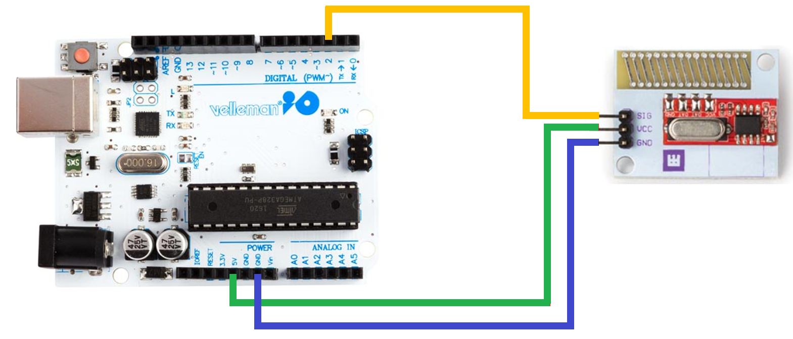
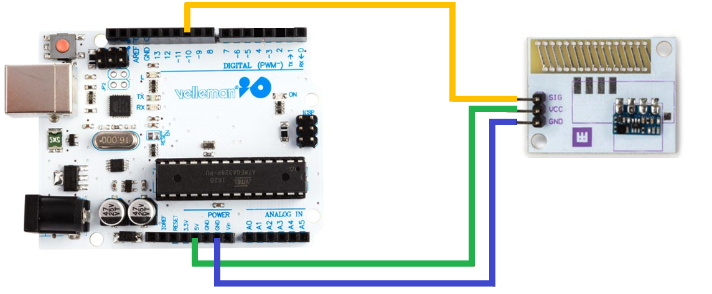

# WPI469 Long-range 433MHz RF wireless module set
This repository is based on [the product's repository](https://github.com/WhaddaMakers/WPI469)

This example shows how you can use the Whadda Long Range 433MHz RF wireless module set (WPI469) with an Arduino® compatible board to receive and send data that turns on an outlet.
# Library dependencies
- RCSwitch.h

# Wiring diagram for the RX module

# Wiring diagram for the TX module

# Additional information
For more information about the Whadda Long Range 433MHz RF wireless module set (WPI469), check the manual available at [whadda.com](https://www.whadda.com)
